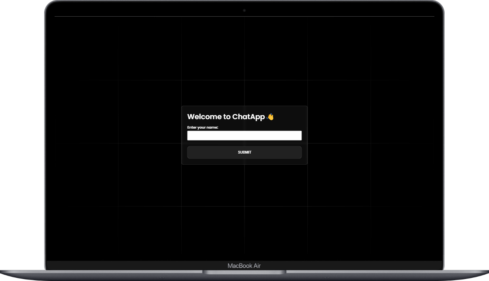
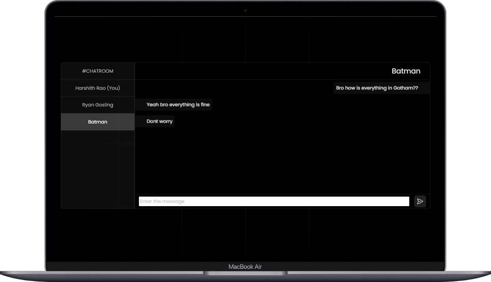
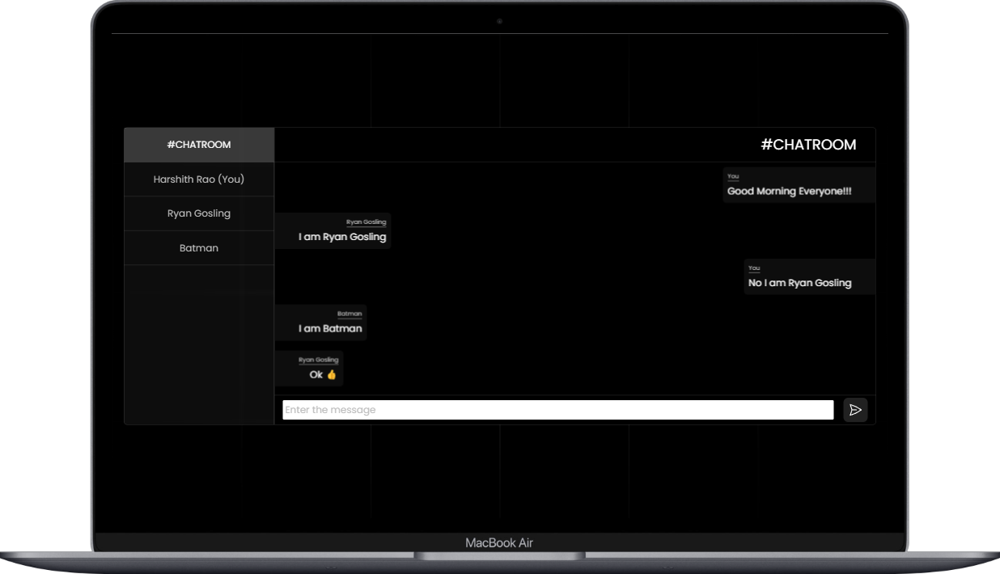

# ChatApp

A simple Chat Application using SocketIO and React


## Tech Stack

**Client:** React, TailwindCSS, Material-Tailwind

**Server:** Node, Express, SocketIO


## How to run locally

**Client** 
```bash
cd client
npm install 
npm run dev
```
**Server** 
```bash
cd server 
npm install
npm start
```

## Screenshots






## Authors

- [Github](https://www.github.com/harshithrao07)
- [Linkedin](https://www.linkedin.com/in/harshithrao07/)
- [Portfolio](https://harshithrao.vercel.app/)
- [Instagram](https://www.instagram.com/harshith._.rao/)
